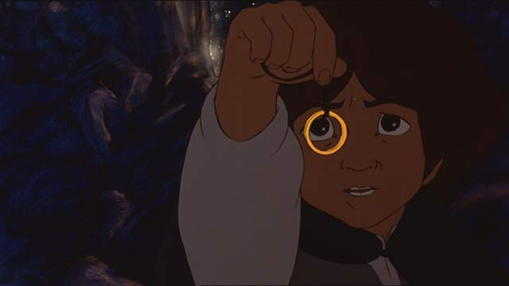

# Fellowship of the Bling ($)



Using our new-found knowledge of jQuery, create a function for each of
the following steps to practice DOM Manipulation, JavaScript, and 
jQuery. 

### Setup

Check out [`js/fellowship.js`](starter/js/fellowship.js). 
This is where you will work.

Starter data (character and land names) has been provided in
[`js/data.js`](starter/js/data.js).

**Remember to work on a localhost server!**

For this exercise you're going to create a **local server** 
This means instead of opening files with Chrome you'll simulate how the browser
would actually access the files from the internet. 

In your terminal, from inside `/starter` directory type `server` and hit enter.

You can close or cancel the server by typing `ctrl-c` in the terminal.

### Directions

1.  Define and invoke the functions outlined below inside of
    [`js/fellowship.js`](starter/js/fellowship.js).
2.  **Do Parts 1 and 2**. Everything else is extra, in case you want
    to continue practicing.
3.  If you finish with Part 5, you can try to chain together
    all of the functions you've created. The easiest way to do this
    is to call them all with `setTimeout`... But you can also
    attempt to chain them using 
    [jQuery's `queue` method][queue].

[queue]: http://stackoverflow.com/questions/1095263/how-do-i-chain-or-queue-custom-functions-using-jquery

---

### Part 1

#### Make Middle Earth

```js
var makeMiddleEarth = function() {
  // 1.  Create a section tag with an id of "middle-earth".
  // 2.  Create an article tag for each land in the lands array.
  // 3.  Give each article tag a class of "land".
  // 4.  Inside each article tag include an h1 tag with the name
  //     of the land as content.
  // 5.  Append each article.land to section#middle-earth.
  // 6.  Append section#middle-earth to the document body.
}

// test this in the console (watch the HTML, though) by running:
makeMiddleEarth();
```

#### Make the Hobbits

```js
var makeHobbits = function() {
  // 1.  Create a ul tag with an id of "hobbits".
  // 2.  Create li tags for each Hobbit in the hobbits array.
  // 3.  Give each li tag a class of "hobbit".
  // 4.  Set the text of each li.hobbit to one of the Hobbits
  //     in the array.
  // 5.  Append the ul#hobbits to the article.land representing 
  //     "The Shire" (the first article tag on the page).
}

// test this in the console (watch the HTML, though) by running:
makeHobbits();
```

### Part 2

#### Keep It Secret, Keep It Safe

```js
var keepItSecretKeepItSafe = function() {
  // 1.  Create a div with an id of "the-ring".
  // 2.  Give div#the-ring a class of "magic-imbued-jewelry".
  // 3.  Add div#the-ring as a child element of the li.hobbit
  //     representing "Frodo."
}

// test this in the console (watch the HTML, though) by running:
keepItSecretKeepItSafe();
```

#### Make Buddies

```js
var makeBuddies = function() {
  // 1.  Create an aside tag.
  // 2.  Create a ul tag with an id of "buddies" and append it to 
  //     the aside tag.
  // 3.  Create li tags for each buddy in the buddies array in 
  //     data.js.
  // 4   Give each li tag a class of "buddy" and append them to 
  //	   "ul#buddies".
  // 5.  Insert the aside tag as a child element of the secion.land 
  //     representing "Rivendell."
}

// test this in the console (watch the HTML, though) by running:
makeBuddies();
```

#### Beautiful Stranger

```js
var beautifulStranger = function() {
  // 1.  Find the li.buddy representing "Strider".
  // 2.  Change the "Strider" text to "Aragorn" and make its 
  //     color green.
}

// test this in the console (watch the HTML, though) by running:
beautifulStranger();
```

#### Leave the Shire

```js
var leaveTheShire = function() {
  // 1.  "Assemble the Hobbits" and move them (as a list) to Rivendell.
}

// test this in the console (watch the HTML, though) by running:
leaveTheShire();
```

### Part 3

#### Forge the Fellowship

```js
var forgeTheFellowShip = function() {
  // 1.  Create a div with an id of "the-fellowship" within the 
  //     section.land for "Rivendell". Append a list to it.
  // 2.  Add each hobbit and buddy one at a time to 
  //     'div#the-fellowship' list.
  // 3.  After each character is added make an alert that they 
  //     have joined your party.
}

// test this in the console (watch the HTML, though) by running:
forgeTheFellowShip();
```

#### The Balrog

```js
var theBalrog = function() {
  // 1.  Select the "li.buddy" for "Gandalf"...
  // 2.  And change its text to "Gandalf the White", and give it
  //     the class "the-white".
  // 3.  Apply style to the element, adding a "3px solid white" 
  //     border to it, giving it a border radius of "10px," and
  //     making it's color white.
}

// test this in the console (watch the HTML, though) by running:
theBalrog();
```

#### Horn of Gondor

```js
// Boromir's been killed by the Uruk-hai!!

var hornOfGondor = function() {
  // 1.  Pop up an alert that the Horn of Gondor has been blown.
  // 2.  Put a line-through on Boromir's name.
  // 3.  Fade Boromir's opacity to 0.3 (he lives on in spirit).
  // 4.  Make Boromir's text color black.
}

// test this in the console (watch the HTML, though) by running:
hornOfGondor();
```

### Part 4

#### It's Dangerous to Go Alone

```js
var itsDangerousToGoAlone = function() {
  // 1.  Create a list with class "soulmates" in Mordor.
  // 2.  Take Frodo and Sam out of The Fellowship and move them 
  //     to ul.soulmates in Mordor.
  // 3.  Add a div with an id of "mount-doom" to Mordor
}

// test this in the console (watch the HTML, though) by running:
itsDangerousToGoAlone();
```

#### "We Wants It!"

```js
function weWantsIt() {
  // 1.  Create a div with an id of "gollum" and add it to Mordor.
  // 2.  Remove The Ring from Frodo and give it to Gollum.
  // 3.  Move Gollum into Mount Doom.
}

// test this in the console (watch the HTML, though) by running:
weWantsIt();
```

#### There And Back Again

```js
function thereAndBackAgain() {
  // 1.  Remove Gollum and the Ring from the document.
  // 2.  Add a list to the shire, and move all the hobbits in to it.
  // 3.  Add the class "collapse" to Mordor.
}

// test this in the console (watch the HTML, though) by running:
thereAndBackAgain();
```

### Part 5

Now that we have all of these functions running, let's add some 
interaction!

0.  When the [page loads][ready], begin playing the sound that can be found
    in the element with id "hobbit-theme";
1.  Add an event listener to the "Ring" (element with id "the-ring").
2.  When the user "clicks" on the Ring, run the function
    `nazgulScreech` (found in [`js/data.js`](starter/js/data.js))
3.  When the user "clicks" on the Ring, it causes Frodo's opacity to go 
    down to 0 for two seconds (using jQuery's `fadeOut`), only to fade 
    back in (using jQuery).
4.  If the Ring is clicked 3 times, the entire body element should 
    disappear, to be replaced with the text:<br>
    `The Ring has been returned to Sauron and the world is over.`
    <br>
    *Good job, Bozo Baggins!*

[ready]: https://learn.jquery.com/using-jquery-core/document-ready/

### Part 6

Use a series of `setTimeout` calls, chained as in the example below,
or (even better) [jQuery's `queue` method][queue] in order to run the
functions in order!

A `setTimeout` example:

```js
var makeMiddleEarth = function() {
  console.log("in the beginning, there was the word...");
  setTimeout(makeHobbits, 2000);
}

var makeHobbits = function() {
  console.log("makin' 'obbits");
}

makeMiddleEarth();
```

**Have the animations begin the second the page loads!**

### Bonus

Add `Play` and `Pause` buttons to the page that begin or stop the
queued animation functions!

This should work, regardless of where in the storyline you are!


#### Resources

- [Official jQuery Documentation](http://jquery.com)
- [MDN](https://developer.mozilla.org/en-US/docs/DOM/DOM_Reference)
- [setTimeout](https://developer.mozilla.org/en-US/docs/Web/API/WindowTimers.setTimeout)
- [LOTR](http://en.wikipedia.org/wiki/The_Lord_of_the_Rings)
