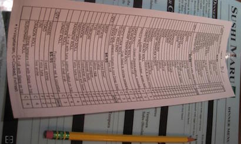

# It's A Ruby Buffet!

Welcome to Ruby everyone! There's so much here to enjoy: classes (datatypes),
operators and blocks, conditionals, loops, arrays, collections, and iterators.
It's a veritable *smörgåsbord* of code!

For your homework tonight, you have to order up some of the Ruby exercises
below. **Complete the first few exercises** in each category, **Blocks**,
**Control Flow**, and **Collections**:

- Blocks: first three,
- Control Flow: first two,
- Collections: first one.

There are more, optional, exercises for each category that you can do if you'd
like more practice, but they are bonuses only. DO NOT DO THEM until you have
finished the first two from each of the categories.

Work on the categories in the order below.

## Blocks

- **[Exercise 1](ruby_blocks.md#exercise-1--calculators-two-files)**
- **[Exercise 2](ruby_blocks.md#exercise-2--road-music)**
- **[Exercise 3](ruby_blocks.md#exercise-3--what-would-opec-do)**
- [Exercise 4](ruby_blocks.md#exercise-4--george-jetson-has-had-enough)
- [Exercise 5](ruby_blocks.md#exercise-5--space-oddity)

## Control Flow

- **[Exercise 1](ruby_control_flow.md#exercise-1--help-me-obi-wan-kenobi)**
- **[Exercise 2](ruby_control_flow.md#exercise-2--youre-a-feisty-little-one)**
- [Exercise 3](ruby_control_flow.md#exercise-3--bounty-hunters--we-dont-need-that-scum)

## Collections

- **[Exercise 1](ruby_collections.md#exercise-1--access-information-in-the-data-structure)**
- [Exercise 2](ruby_collections.md#exercise-2--interact-with-the-data-in-the-structure)
- [Exercise 3](ruby_collections.md#exercise-3--add-and-remove-data-in-the-structure)
- [Exercise 4](ruby_collections.md#exercise-4--begin-working-with-the-data-structure)
